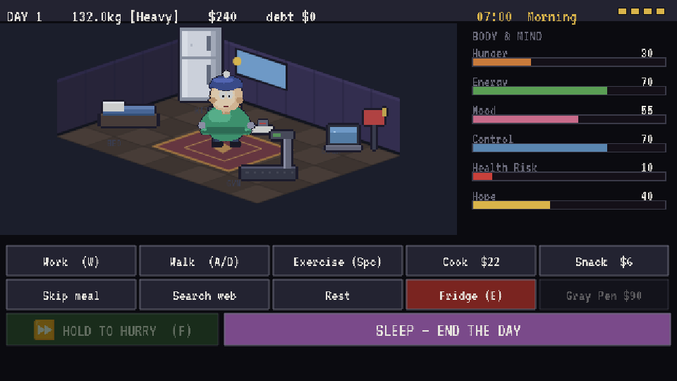
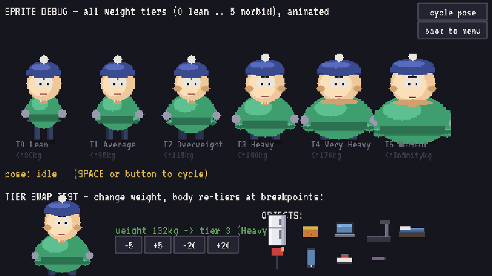
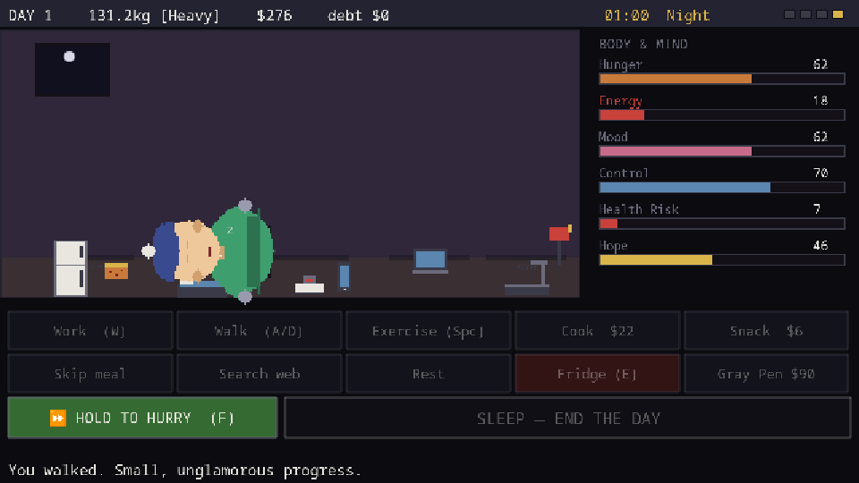

# The Cruel Game of Life

> A brutal vicious-cycle survival clicker. You are trying to get healthy while
> poverty, cravings, fatigue, debt, and bad luck keep dragging you back.
> **The body isn't the joke, the *system* is.** Lose too fast and you die; lose
> too slow and you suffer. Every "solution" creates a new problem.

### ▶ [Play it in your browser](https://darthm1ke.github.io/the-cruel-game-of-life/)




A daily-cycle survival game where the body, money, hunger, energy, mood, and
self-control are all systems fighting each other. You spend each day's hours on
real actions (work, walk, exercise, cook, snack, rest, doomscroll, open the fridge)
and watch the clock and the light shift from morning to night, while the systems
quietly conspire against you.

Built from the design conversation in [`convoaboutgame.md`](./convoaboutgame.md).

## Features
- **A day you can feel.** Actions play out in real time with a sweeping clock and a
  day/night cycle; hold to hurry. End the day and the character walks to bed and
  sleeps through the night.
- **A room you live in.** The apartment is split into zones (kitchen, bed, desk,
  gym); the character walks to the right spot to perform each action.
- **The body changes.** Six weight tiers, from lean to morbid, drawn procedurally
  and swapped live as your weight changes.
- **Systems with teeth.** A binge spiral, health crashes and hospital debt, a
  starvation spiral, and a `Control` stat that, at zero, starts playing the game
  *for* you (badly).
- **Brutally fair.** Difficulty tuned by simulation: the best strategy still only
  wins about 1 in 12 runs, and death comes from every direction.

## Artists wanted (collaboration)

> Side note: I'm looking for interested artists who want to collaborate on turning
> this into a profitable game by creating real, hand-made art instead of the
> procedurally generated sprites currently in use. If that sounds like you, open an
> issue on this repo or reach out, I'd love to talk.

## Screens

| Weight tiers (lean to morbid) | Sleeping through the night |
| --- | --- |
|  |  |

## Stack
- **Phaser 3** (WebGL, pixel-perfect 8-bit rendering)
- **TypeScript** + **Vite**
- **All art is procedurally generated in code** - no image assets. The protagonist
  has 6 weight tiers (Lean -> Morbid) and swaps body sprite as `weight` changes.

## Run it
```bash
npm install
npm run dev        # play at http://localhost:5173
npm run build      # type-check + static production build -> dist/
```

From the main menu, **"sprite debug view"** shows all weight tiers, pose cycling,
a live tier-swap test, and every object icon.

## Verify it
A headless Chrome harness confirms the game boots clean, screenshots every scene,
and runs 20 assertions against the pure game engine (daily cycle, action deltas,
binge, health crash, control override, game-over causes, the Gray Pen unlock).

```bash
npm run dev                 # in terminal 1
node scripts/verify.mjs     # in terminal 2  -> screenshots land in verify-shots/
```

## Layout
| Path | What |
|------|------|
| `src/config.ts`   | All tuning: stats, weight tiers, palette, balance knobs |
| `src/state/`      | Pure game engine (no Phaser) - testable headlessly |
| `src/art/`        | Procedural pixel-art generators (man tiers + objects) |
| `src/scenes/`     | Phaser scenes: Boot, Preload, Menu, Game, GameOver, Debug |
| `src/ui/`         | Stat bars, buttons, pixel text |
| `scripts/verify.mjs` | Headless verification harness |
| `docs/ART.md`     | Rich descriptions of the character + every procedural asset |
| `public/assets/`  | Drop-in pixel-art spec (replace any sprite with real art) |
| `CHECKPOINTS.md`  | Roadmap + per-item verification notes + resume state |

## Status
Playable vertical slice. See [`CHECKPOINTS.md`](./CHECKPOINTS.md) for exactly what's
done, what's verified, and what's next.
